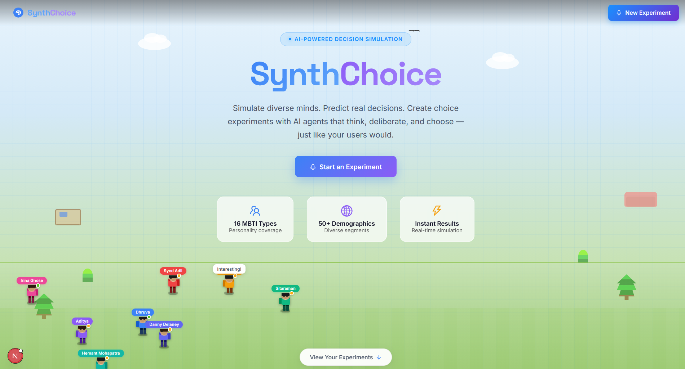
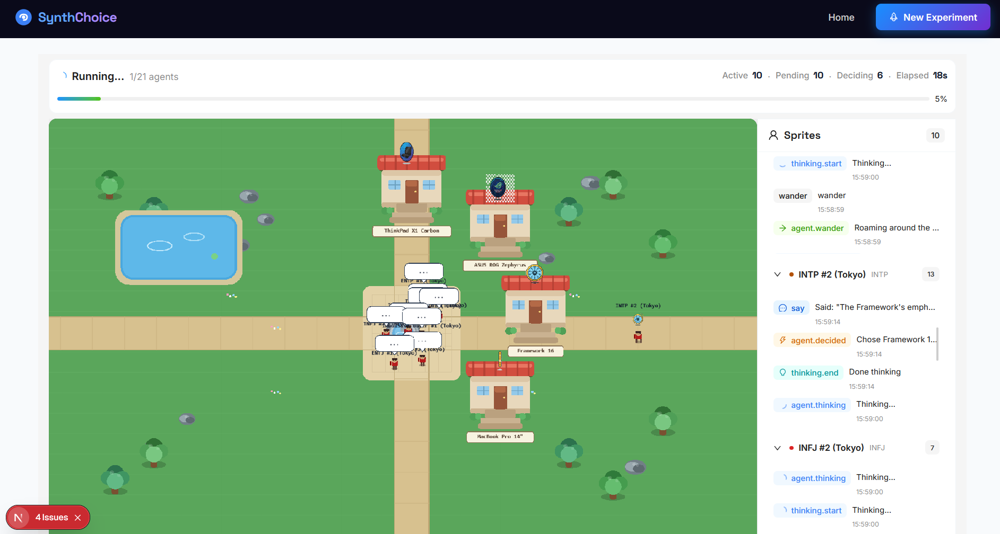
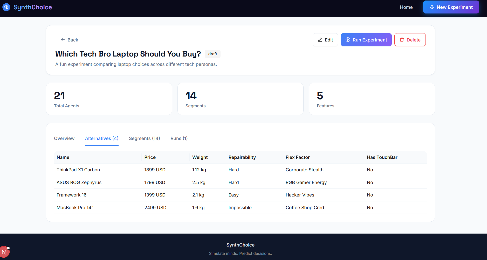
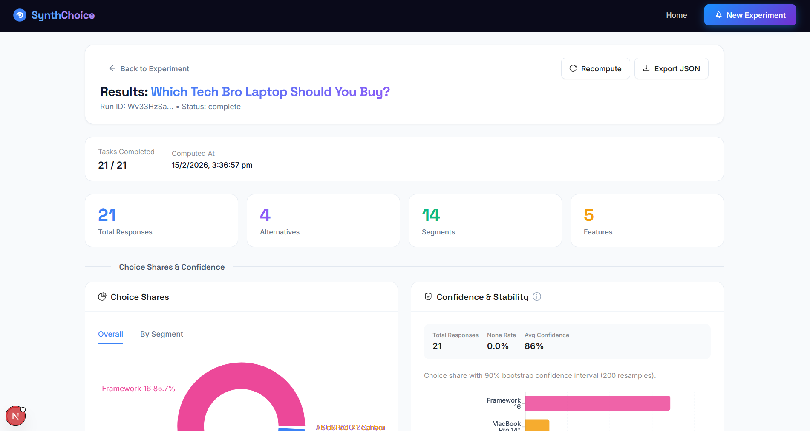
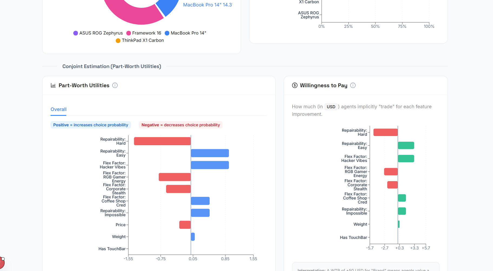
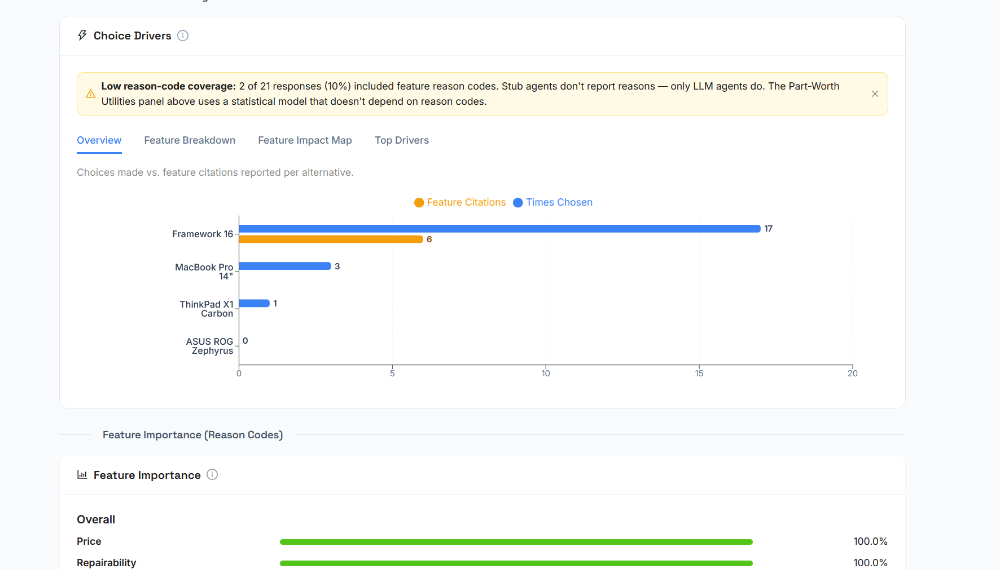

# SynthChoice

<p align="center">
  
</p>

<p align="center">
  <strong>Simulate minds. Predict decisions.</strong>
</p>

<p align="center">
  Create choice experiments with AI agents that think, deliberate, and choose — just like your users would.
</p>

<p align="center">
  <a href="https://synthchoice.vercel.app/">https://synthchoice.vercel.app/ (Live Demo)</a>
</p>

## Demo

### Video walkthrough

<video src="public/readme/synthchoice.mp4" controls width="100%"></video>

### Screenshots

| Landing | Simulation in progress |
|---------|------------------------|
|  |  |

| Experiment setup | Results dashboard |
|------------------|-------------------|
|  |  |

| Conjoint analysis | Choice drivers |
|-------------------|----------------|
|  |  |

## Overview

SynthChoice is an **AI-powered decision simulation** platform for conjoint analysis and choice modeling. Define alternatives, configure agent segments (personality types, demographics, preferences), and run simulations to predict how different user segments would choose.

### What you can do

1. **Setup experiments** — Define feature schemas, add alternatives, configure agent segments (16 MBTI types, 50+ demographics)
2. **Run simulations** — Watch agents evaluate and choose in real time with a visual simulation
3. **Analyze results** — View choice shares, part-worth utilities, willingness to pay, and feature importance

---


---

## Running the project

### Prerequisites

- **Node.js** 18 or later
- **pnpm** (recommended) or npm
- **Firebase project** with Firestore and Anonymous Auth enabled

### Quick start

```bash
# Clone the repository
git clone https://github.com/shero4/synthchoice.git
cd synthchoice

# Install dependencies (use pnpm)
pnpm install

# Start the development server
pnpm dev
```

Open [http://localhost:3000](http://localhost:3000) in your browser.

### Firebase setup

1. Create a project at [Firebase Console](https://console.firebase.google.com)
2. Enable **Firestore Database**
3. Enable **Anonymous Authentication** (Authentication → Sign-in methods)
4. Copy your config and update `src/lib/firebase/client.js`:

```javascript
const firebaseConfig = {
  apiKey: "YOUR_API_KEY",
  authDomain: "YOUR_PROJECT.firebaseapp.com",
  projectId: "YOUR_PROJECT_ID",
  storageBucket: "YOUR_PROJECT.firebasestorage.app",
  messagingSenderId: "YOUR_SENDER_ID",
  appId: "YOUR_APP_ID",
};
```

### Available scripts

| Command | Description |
|--------|-------------|
| `pnpm dev` | Start development server |
| `pnpm build` | Build for production |
| `pnpm start` | Start production server |
| `pnpm lint` | Run Biome linter |
| `pnpm format` | Format code with Biome |

---

## Tech stack

- **Framework:** Next.js 16 (App Router)
- **UI:** Ant Design
- **State:** Redux Toolkit
- **Backend:** Firebase (Firestore, Auth, Storage)
- **Visualization:** Recharts, Pixi.js
- **Language:** JavaScript

---

## Project structure

```
src/
├── app/                    # Next.js App Router
│   ├── layout.js
│   ├── page.js             # Home / experiment list
│   └── experiments/
│       ├── new/page.js     # Create experiment
│       └── [experimentId]/
│           ├── page.js     # Experiment detail
│           ├── run/page.js # Run simulation
│           └── results/[runId]/page.js
├── components/
│   ├── layout/             # App shell
│   ├── experiment/         # Setup (schema, alternatives, segments)
│   ├── runner/             # Simulation runner
│   └── results/            # Charts, shares, conjoint
├── lib/
│   ├── firebase/           # Auth, Firestore, Storage
│   ├── domain/             # Schema, taskgen, simulate, aggregate
│   └── sprites/
└── store/                  # Redux slices
```

---

## Key concepts

### Experiment

A study configuration with:

- **Feature schema** — Continuous, categorical, or binary features
- **Alternatives** — Options agents choose between
- **Agent plan** — Segments with counts and traits (MBTI, location, price sensitivity, etc.)
- **Task plan** — Tasks per agent, holdouts, repeats

### Agent segments

Groups of simulated respondents with shared traits: location, personality type, price sensitivity, risk tolerance, consistency.

### Results

- **Choice shares** — Overall and by segment
- **Part-worth utilities** — Feature impact on choice probability
- **Willingness to pay** — Implicit monetary value of features
- **Choice drivers** — Feature importance from reason codes (LLM agents)

---

## Firestore data model

```
experiments/{experimentId}
├── alternatives/{alternativeId}
├── agents/{agentId}
└── runs/{runId}
    ├── tasks/{taskId}
    ├── responses/{responseId}
    └── resultsSummary/v1
```

---

## Roadmap

- [ ] LLM-based decision engine (BYO API key)
- [ ] Alternative normalization via LLM
- [ ] Export results to CSV/JSON
- [ ] Advanced analytics (logit models)
- [ ] Sprite image generation
- [ ] Team collaboration

---

## License

MIT
